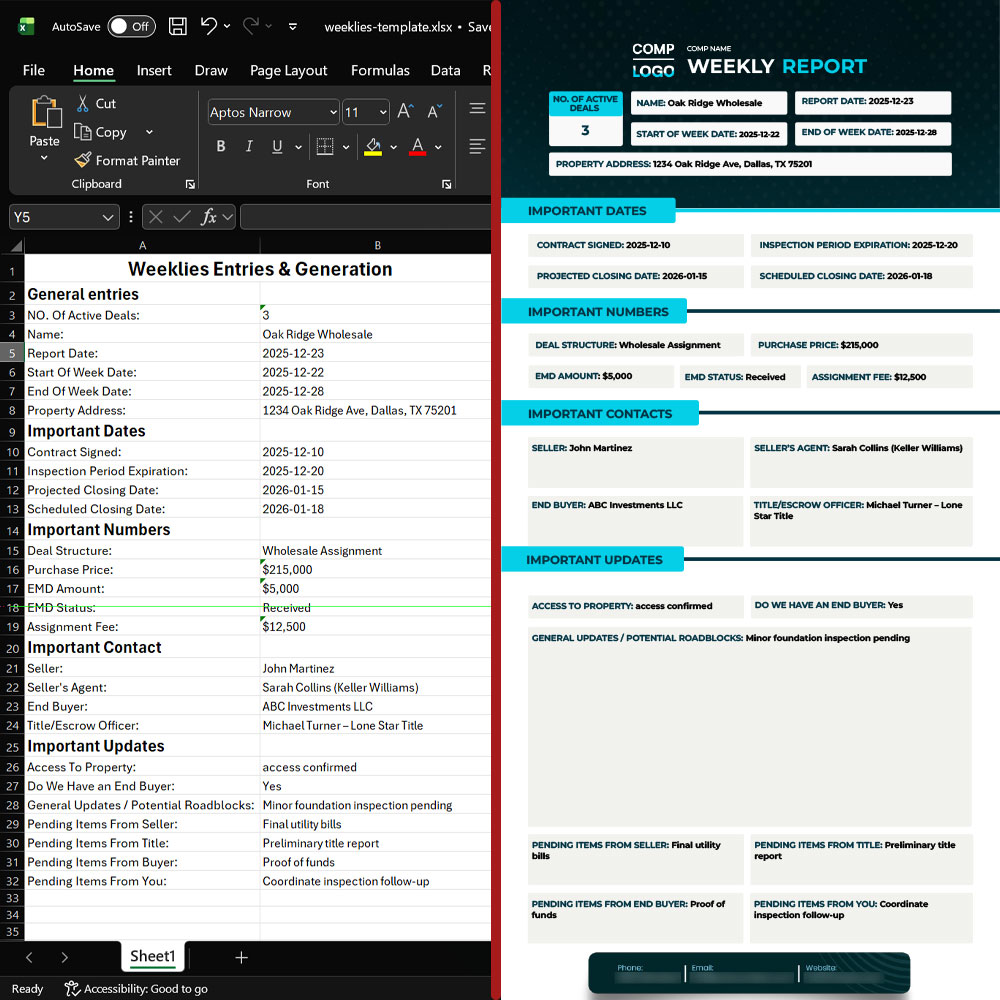

# Weeklies Generator

A web app that creates weekly reports in PDF format. Upload data manually or in bulk via Excel.

> ⚠️ **Note:** This is a documentation-only repository. No production credentials or sensitive data included.

---

## 📺 See It In Action

Full walkthrough video: [Weeklies Generator - Full Application Walkthrough](https://youtu.be/zYoChiV74Ow)

---

## Features

- **Dual input methods** — Manual form entry or bulk Excel upload
- **Real-time PDF generation** — Immediate document creation
- **Batch processing** — Generate multiple reports from a single Excel file
- **JWT authentication** — Secure, token-based user sessions
- **Activity logging** — Full audit trail of all requests and responses
- **Automatic cleanup** — Scheduled maintenance for temporary files

---

## Tech Stack

| Layer                          | Technology                                |
| ------------------------------ | ----------------------------------------- |
| **Languages**                  | Python, TypeScript, SQL                   |
| **Package Managers**           | uv (Astral), pnpm                         |
| **Frontend**                   | Next.js (App Router), React, Tailwind CSS |
| **Backend**                    | FastAPI, Uvicorn                          |
| **Data Validation**            | Pydantic, Pydantic Settings               |
| **ORM / Data Access**          | SQLAlchemy                                |
| **Database**                   | PostgreSQL                                |
| **Document Processing**        | DocxTemplate (docxtpl), LibreOffice       |
| **Logging**                    | Loguru                                    |
| **Data Processing**            | Pandas                                    |
| **Host OS**                    | Ubuntu                                    |
| **Reverse Proxy / Web Server** | Nginx                                     |

---

## How To Use

### Option 1: Single Report (Form)
1. Fill out the form on the Weeklies page
2. Click "Generate Weekly"
3. Download your PDF

### Option 2: Multiple Reports (Excel)
1. Download the Excel template
2. Fill in your data (one row per report)
3. Upload the file
4. Download your PDFs (as a ZIP if multiple)

**Example:**
### Excel Input | PDF Output


---

## Main API Endpoints

**Health Checks**
- `GET /health` — Check if server is running
- `GET /health/db` — Check database connection

**User Accounts**
- `POST /auth/jwt/login` — Log in
- `POST /auth/jwt/logout` — Log out
- `GET /auth/me` — Get your profile

**Generate Reports**
- `POST /weeklies/form-entry` — Create one report from form
- `POST /weeklies/bulk-entry` — Create many reports from Excel
- `GET /weeklies/download` — Download your files

**View Activity**
- `GET /logs/` — See all logged actions

---

## Project Structure

```
/backend
  /app
    /api          # API routing and endpoint configuration
    /core         # Application config, logging, middleware, scheduler
    /db           # Database connection and session management
    /domains      # Business logic: auth, logs, weeklies
    /resources    # Document templates (DOCX, Excel)
  main.py         # Application entry point

/frontend
  /src
    /app          # Next.js pages: login, dashboard, weeklies
    /features     # Feature-specific components and services
    /lib          # API client, storage utilities
```

---

## Architecture Highlights

**Authentication Flow**
- IP allowlisting at network layer (frontend → backend only)
- JWT-based authentication with secure token storage
- Protected routes with automatic redirect on auth failure

**Document Generation Pipeline**
1. Input validation (Pydantic schemas)
2. DOCX template population (docxtpl)
3. LibreOffice conversion to PDF
4. Streaming response or ZIP archive

**Logging System**
- Non-blocking middleware for request/response capture
- SQLAlchemy ORM with PostgreSQL persistence
- Sanitized sensitive data in audit logs

**Scheduled Maintenance**
- APScheduler integration with FastAPI lifespan
- Configurable cleanup intervals via environment variables
- Graceful shutdown handling

---

## Future Plans

- Rate limiting
- Admin dashboard for viewing logs
- Background job processing for large uploads

---

## License

This is a proprietary application. Shared for reference only — no copying or redistribution allowed.